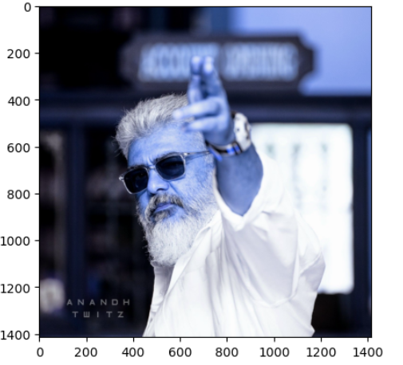

# Histogram-of-an-images
## Aim
To obtain a histogram for finding the frequency of pixels in an Image with pixel values ranging from 0 to 255. Also write the code using OpenCV to perform histogram equalization.

## Software Required:
Anaconda - Python 3.7

## Algorithm:
### Step1:
Read the gray and color image using imread()

### Step2:
Print the image using imshow().


### Step3:
Use calcHist() function to mark the image in graph frequency for gray and color image.

### step4:
Use calcHist() function to mark the image in graph frequency for gray and color image.

### Step5:
The Histogram of gray scale image and color image is shown.


## Program:
### Developed By: Ashwin Akash M
### Register Number: 212223230024
## Output:
### Input Grayscale Image and Color Image
## Gray Image:
```
import cv2
import matplotlib.pyplot as plt
gray_image=cv2.imread('vijay.jpg')
grey=cv2.cvtColor(gray_image,cv2.COLOR_BGR2GRAY)
plt.imshow(grey)
plt.axis('on')
plt.show()
```

## Color Image:
```
color_image=cv2.imread('ajith1.jpg')
plt.imshow(color_image)
plt.axis('on')
plt.show()
```

### Histogram of Grayscale Image and any channel of Color Image
## Gray Image:
```
import numpy as np
Gray_image = cv2.imread("vijay.jpg")
Color_image = cv2.imread("ajith1.jpg")
grey=cv2.cvtColor(gray_image,cv2.COLOR_BGR2GRAY)
gray_hist = cv2.calcHist([grey],[0],None,[1100],[0,1100])
plt.figure()
plt.imshow(grey)
plt.show()
plt.title("Histogram")
plt.xlabel("Grayscale Value")
plt.ylabel("Pixel Count")
plt.stem(gray_hist)
plt.show()
```


## Color Image:
```
color_hist = cv2.calcHist([Color_image],[0],None,[2600],[0,2600])
plt.figure()
plt.imshow(color_image)
plt.show()
plt.title("Histogram")
plt.xlabel("Grayscale Value")
plt.ylabel("Pixel Count")
plt.stem(color_hist)
plt.show()
```


### Histogram Equalization of Grayscale Image.
## Gray Image:
```
gray_image = cv2.imread("vijay.jpg")
grey=cv2.cvtColor(gray_image,cv2.COLOR_BGR2GRAY)
plt.imshow(grey)
plt.show()
```

```
equ = cv2.equalizeHist(grey)
plt.imshow(equ)
plt.show()
```

## Color Image:
```
color_image=cv2.imread('ajith1.jpg')
grey=cv2.cvtColor(color_image,cv2.COLOR_BGR2GRAY)
plt.imshow(color_image)
plt.show()
```

```
eq = cv2.equalizeHist(grey)
plt.imshow(eq)
plt.show()
```

## Result: 
Thus the histogram for finding the frequency of pixels in an image with pixel values ranging from 0 to 255 is obtained. Also,histogram equalization is done for the gray scale image using OpenCV.
